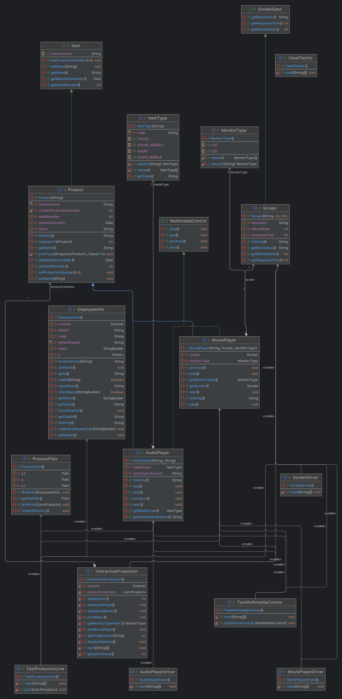

# OraclProduction Project - Производственная Линия Мультимедиа

## Обзор Проекта

Этот проект представляет собой симуляцию производственной линии для компании OraclProduction Ltd., специализирующейся на создании мультимедийных устройств.  Он разработан как гибкий шаблон на Java, который можно адаптировать для производства различных типов продуктов.  В текущей реализации основное внимание уделяется производству аудиоплееров и портативных видеоплееров.

Проект следует пошаговым инструкциям из документа `OrclProductionline.pdf`, реализуя объектно-ориентированные принципы, включая интерфейсы, абстрактные классы, перечисления, наследование и полиморфизм.

## Основные Возможности

* **Моделирование Продуктов:**
    * Определение базовых характеристик продукта (серийный номер, производитель, дата производства, имя) через интерфейс `Item` и абстрактный класс `Product`. 
    * Реализация конкретных продуктов: `AudioPlayer` и `MoviePlayer`. 
    * Управление серийными номерами с автоматическим инкрементом. 
* **Мультимедиа Управление:**
    * Общий интерфейс `MultimediaControl` для стандартных действий (play, stop, next, previous). 
    * Реализация управления для аудио- и видеоплееров. 
* **Характеристики Экрана:**
    * Интерфейс `ScreenSpec` для определения характеристик экрана (разрешение, частота обновления, время отклика).
    * Класс `Screen` для реализации спецификаций экрана. 
    * Перечисление `MonitorType` (LCD, LED). 
* **Типизация Элементов:**
    * Перечисление `ItemType` для классификации продуктов (AUDIO, VISUAL, AUDIO_MOBILE, VISUAL_MOBILE). 
* **Информация о Сотруднике:**
    * Класс `EmployeeInfo` для сбора и обработки данных сотрудника (имя, генерация кода пользователя, ввод и валидация ID отдела).
    * Шифрование ID отдела методом реверсирования строки (рекурсивно). 
* **Коллекции и Сортировка:**
    * Использование `ArrayList` для хранения произведенных продуктов. 
    * Сортировка продуктов по имени с использованием `Collections.sort()` и реализации `Comparable` в классе `Product`. 
* **Работа с Файлами:**
    * Класс `ProcessFiles` для записи информации о произведенных продуктах и данных сотрудника в файл `LineTests/TestResults.txt`. 
    * Запись в файл в режиме добавления (`append`) для сохранения истории тестов. 
    * Создание необходимой директории (`LineTests`), если она отсутствует. 
    * Класс `ViewFileInfo` для чтения и отображения содержимого файла `TestResults.txt`. 
* **Интерактивный Режим:**
    * Класс `InteractiveProduction` предоставляет консольное меню для интерактивного добавления продуктов, просмотра коллекции и отображения статистики производства.
* **Тестирование и Демонстрация:**
    * Различные классы-драйверы (`TestProductionLine`, `TestMultimediaControl`, `AudioPlayerDriver`, `MoviePlayerDriver`, `ScreenDriver`) для демонстрации функциональности отдельных компонентов и всей системы.

## Структура Проекта

* **`pom.xml`**: Файл конфигурации Maven, определяющий структуру проекта и зависимости (хотя в данном проекте внешние зависимости не используются).
* **`src/main/java/productionline`**: Основной пакет с исходным кодом проекта.
    * **Интерфейсы**: `Item.java`, `MultimediaControl.java`, `ScreenSpec.java`
    * **Перечисления**: `ItemType.java`, `MonitorType.java`
    * **Абстрактный класс**: `Product.java`
    * **Конкретные классы продуктов**: `AudioPlayer.java`, `MoviePlayer.java`, `Screen.java`
    * **Вспомогательные классы**: `EmployeeInfo.java`, `ProcessFiles.java`
    * **Классы-драйверы/Тесты**:
        * `TestProductionLine.java`: Основной драйвер, демонстрирующий создание продуктов, сбор в коллекцию, сортировку, запись в файл информации о сотруднике и продуктах.
        * `TestMultimediaControl.java`: Демонстрирует полиморфизм с интерфейсом `MultimediaControl`.
        * `AudioPlayerDriver.java`: Тестирует класс `AudioPlayer`.
        * `MoviePlayerDriver.java`: Тестирует класс `MoviePlayer`.
        * `ScreenDriver.java`: Тестирует класс `Screen`.
        * `ViewFileInfo.java`: Драйвер для чтения и вывода файла `TestResults.txt`.
        * `InteractiveProduction.java`: Запускает интерактивный консольный режим симуляции.
* **`LineTests/`**: Директория (создается автоматически при запуске `TestProductionLine`), содержащая файл с результатами тестов.
    * **`TestResults.txt`**: Файл, куда записываются данные о произведенных продуктах и сотруднике, запустившем тест. [source: 98]

## Начало Работы

### Предварительные Требования

* Установленный JDK (версия 21 или выше, как указано в `pom.xml`).
* Установленный Apache Maven (для сборки и управления проектом).
* IDE (например, IntelliJ IDEA, Eclipse) с поддержкой Maven.

### Запуск

Проект содержит несколько классов с методом `main` для запуска различных частей симуляции:

1.  **`TestProductionLine.java`**:
    * Симулирует один производственный цикл.
    * Создает несколько аудио- и видеоплееров.
    * Добавляет их в коллекцию.
    * Печатает несортированную и отсортированную коллекции в консоль.
    * Запрашивает у пользователя имя и ID отдела для `EmployeeInfo`.
    * Записывает информацию о продуктах и сотруднике в файл `LineTests/TestResults.txt`.
    * **Как запустить**: Запустите метод `main` в этом классе.

2.  **`InteractiveProduction.java`**:
    * Запускает интерактивное консольное приложение.
    * Позволяет пользователю многократно добавлять аудио- или видеоплееры, указывая их количество.
    * Позволяет просматривать текущую коллекцию продуктов.
    * Позволяет отображать статистику производства (общее количество, количество по типам, уникальные продукты).
    * **Как запустить**: Запустите метод `main` в этом классе.

3.  **`ViewFileInfo.java`**:
    * Читает содержимое файла `LineTests/TestResults.txt`.
    * Выводит содержимое файла в консоль.
    * Обрабатывает случай, если файл не найден.
    * **Как запустить**: Запустите метод `main` в этом классе (желательно после запуска `TestProductionLine`, чтобы файл был создан).

4.  **Другие драйверы (`AudioPlayerDriver`, `MoviePlayerDriver`, `ScreenDriver`, `TestMultimediaControl`)**:
    * Предназначены для тестирования и демонстрации отдельных классов или концепций (например, полиморфизма).
    * **Как запустить**: Запустите метод `main` в соответствующем классе.

## Файл Вывода (`LineTests/TestResults.txt`)

Этот файл генерируется при запуске `TestProductionLine.java`. Он содержит записи о каждом производственном запуске (список продуктов) и информацию о сотруднике, проводившем тест. Данные добавляются в конец файла при каждом запуске, сохраняя историю. Формат вывода в файле соответствует формату консольного вывода.

## UML Диаграмма классов

